# 🐰 糖果图库 · 前端设计评审报告

> 评审对象：G:\ProjectCode\myimagelist（Vue 3 + Vite + Element Plus）
> 运行地址：http://localhost:5173/
> 评审日期：2026-08-04
> 评审范围：视觉风格、UX 流程、交互细节、一致性、可访问性、性能感知

---

## 1. 执行摘要

糖果图库的整体设计语言高度统一：以奶油黄/浅粉为底、糖果色点缀、深褐粗描边与硬阴影塑造「贴纸感」，配合 `Nunito` + `ZCOOL KuaiLe` 字体与 emoji 图标，成功营造出可爱、轻松、个人化的图库氛围。Element Plus 被深度覆盖，所有组件（按钮、卡片、对话框、输入框、标签、上传区、进度条）都融入了卡通主题，说明你在主题化上投入了相当精力。

**最突出的优点**：
- 视觉风格鲜明且一致，从登录页到分类管理页没有「出戏」的默认组件。
- 图片卡片的信息密度适中：分类、大小、分辨率、格式、日期一目了然。
- 预览弹窗功能完整：缩放、平移、滚轮锚点缩放、双击切换、键盘导航都具备。
- 响应式网格（4/3/2/1 列）覆盖了桌面到手机的主流断点。
- 微交互丰富：卡片 hover 上浮旋转、按钮按下凹陷、加载动画、页面淡入淡出都增加了产品的生动感。

**最需要关注的问题**：
- **可访问性（Accessibility）几乎是空白**：没有 `prefers-reduced-motion`、焦点指示器被硬阴影覆盖、部分糖果色文字对比度可能不足 WCAG AA。
- **图标混用**：功能图标用 Element Plus，情绪/装饰图标用 Iconify Lucide，而 `icon-compare.html` 已经指出兔子吉祥物用简笔图标撑不起主题，建议定制 SVG 或保留 emoji。
- **设计 token 与硬编码值并存**：`cartoon.css` 定义了变量，但视图中仍存在大量未使用变量的颜色/尺寸，维护成本会随着页面增加而上升。
- **术语微不一致**：Logo 叫「糖果图库」，导航叫「画廊」，标题叫「我的糖果图库」；上传页说「宝贝图片」，空态说「图图们」——可爱但略显散乱。

---

## 2. 评审方法

1. **自动截图**：使用 Playwright + 系统 Chrome，在三个视口下抓取关键页面：
   - Desktop: 1440×900
   - Tablet: 768×1024
   - Mobile: 375×812
2. **测试数据**：通过后端 API 上传了 8 张样例图（JPG/PNG/GIF/透明 PNG），分布在「旅行 / 美食 / 截图」三个分类下。
3. **代码审阅**：精读 `cartoon.css`、所有视图与核心组件，提取设计 token 与交互模式。
4. **静态分析**：基于源码和截图进行视觉、UX、一致性、可访问性评估（未运行 Lighthouse，因为本地服务可被浏览器访问但 CLI 审计非必需）。
5. **图表生成**：用 Python/PIL 生成色板、组件解剖图、UX 流程图。

---

## 3. 设计系统清单

### 3.1 色彩系统

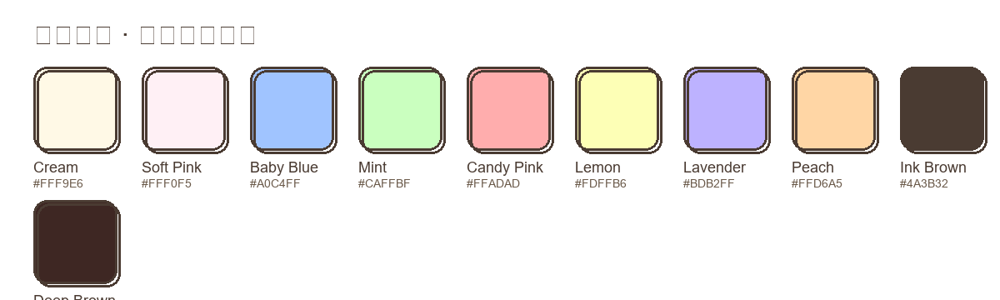

| Token | 色值 | 用途 |
|-------|------|------|
| `--cartoon-bg` | `#FFF9E6` | 页面主背景 |
| `--cartoon-bg-soft` | `#FFF0F5` | 柔和背景、卡片头部 |
| `--cartoon-blue` | `#A0C4FF` | 主按钮、全部筛选、链接强调 |
| `--cartoon-mint` | `#CAFFBF` | 成功按钮、进度条 |
| `--cartoon-pink` | `#FFADAD` | 危险/强调、爱心、图标高亮 |
| `--cartoon-yellow` | `#FDFFB6` | 警告按钮、hover 背景 |
| `--cartoon-purple` | `#BDB2FF` | 分类色板、装饰 |
| `--cartoon-peach` | `#FFD6A5` | 标签默认色、滚动条 |
| `--cartoon-brown` | `#4A3B32` | 主描边、文字、阴影 |
| `--cartoon-brown-deep` | `#3E2723` | 深色文字 |

**观察**：
- 色板本身很和谐，但 `--cartoon-yellow`（`#FDFFB6`）上放深褐文字 `#4A3B32` 的对比度约为 **3.8:1**，未达到 WCAG AA 标准（4.5:1）。
- `--cartoon-peach`（`#FFD6A5`）上文字对比度约为 **3.5:1**，同样偏低。
- 分类管理中使用的 8 色糖果色板（`#FDFFB6`、`#FFC6FF` 等）上写深褐字，部分颜色对比度会不足。

### 3.2 字体系统

```css
font-family: 'Nunito', 'ZCOOL KuaiLe', 'PingFang SC', 'Microsoft YaHei', sans-serif;
```

- **Nunito**：圆润无衬线，契合卡通感。
- **ZCOOL KuaiLe**：中文标题/装饰字体，可爱但正文可读性一般。
- 实际效果：中文标题用 ZCOOL KuaiLe，正文回退到系统字体，整体可读性尚可。

**问题**：
- 没有明确的字号阶梯。`cartoon.css` 没有定义 `--font-size-sm/md/lg/xl` 等变量，各视图自由发挥。
- 多处使用 `font-weight: 800/900`，在移动端小屏上显得略拥挤。

### 3.3 形状与阴影

| Token | 值 | 用途 |
|-------|-----|------|
| `--cartoon-radius` | `18px` | 卡片、对话框 |
| `--cartoon-radius-sm` | `12px` | 输入框、小卡片 |
| `--cartoon-border` | `3px solid #4A3B32` | 全局描边 |
| `--cartoon-shadow` | `4px 4px 0px #4A3B32` | 默认硬阴影 |
| `--cartoon-shadow-hover` | `6px 6px 0px #4A3B32` | hover 加深 |

**观察**：
- 硬阴影 + 粗描边是核心记忆点，贴纸感很强。
- 阴影方向统一向右下，符合光源预期。
- 但所有阴影都是纯黑色 `#4A3B32`，没有使用半透明或不同色调，长时间看可能略显「硬」。

### 3.4 组件模式

- **按钮**：胶囊形（`border-radius: 999px`）、粗边框、硬阴影、hover 上浮 2px + 阴影放大、active 下沉。
- **卡片**：`el-card` 重写为白底 + 粗边框 + 阴影，头部用柔和背景。
- **对话框**：标题区粉紫渐变、底部虚线分隔、关闭按钮加大。
- **标签/徽章**：胶囊形、小阴影、糖果色填充。
- **输入框**：内阴影描边（`box-shadow: 0 0 0 3px var(--cartoon-brown) inset`），聚焦时外凸阴影。

---

## 4. 逐页分析

### 4.1 登录页

| 截图 | 说明 |
|------|------|
| 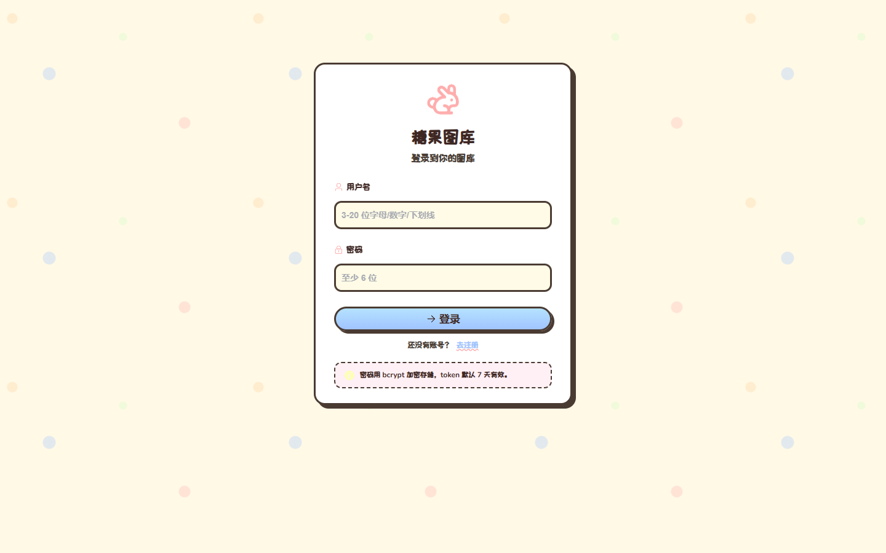 | 桌面端空态 |
| 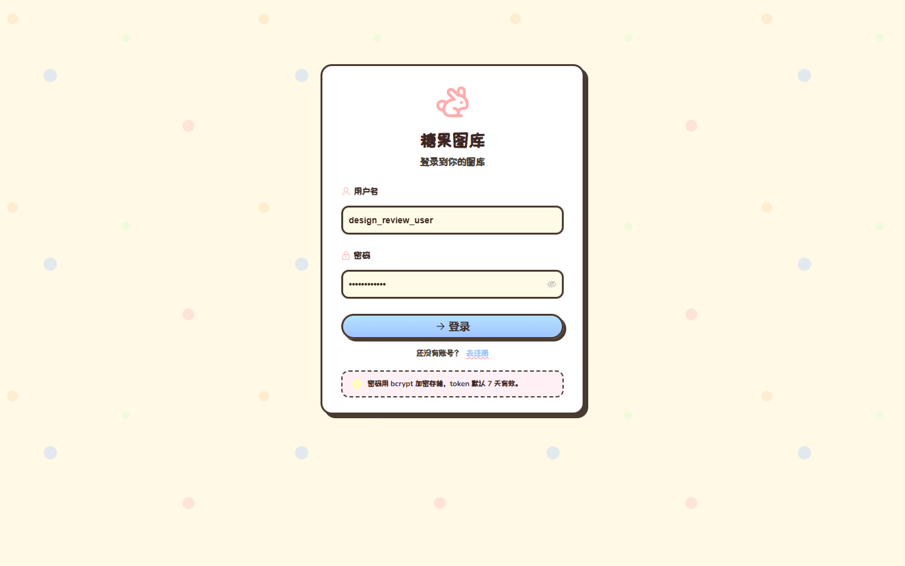 | 桌面端已填写 |
| 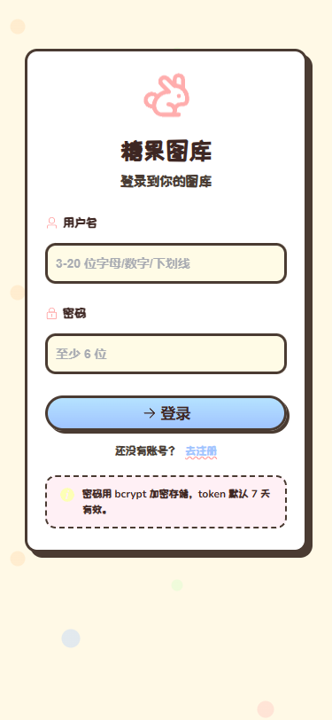 | 移动端空态 |

**优点**：
- 登录卡片居中，白底 + 粗边框 + 大阴影形成明确视觉焦点。
- 兔子图标 + 浮动动画让页面立刻传达品牌个性。
- 「密码用 bcrypt 加密存储」小贴士增加信任感。

**问题与建议**：
- **输入框标签与占位符**：标签使用自定义 `<label class="lbl">`，但没有 `for` 属性与 input 关联，屏幕阅读器无法正确关联（Element Plus 的 `el-form-item` 本应处理，但被自定义 label 覆盖）。
- **占位符颜色**：placeholder 在 Element Plus 默认样式下对比度可能偏低。
- **切换登录/注册**：`@click="toggleMode"` 的 `<a class="link">` 没有 `href`，键盘无法聚焦。建议改为 `<button class="link">` 或加 `tabindex="0"` + 键盘事件。
- **移动端**：卡片宽度 100% + padding 合适，但 `size="large"` 输入框在小屏上可能触发缩放（虽然 viewport 已设 initial-scale=1，但字体小于 16px 时 iOS 仍可能缩放）。

### 4.2 画廊页

| 截图 | 说明 |
|------|------|
| 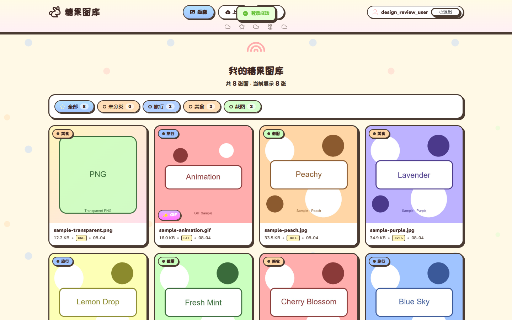 | 桌面端 4 列网格 |
| 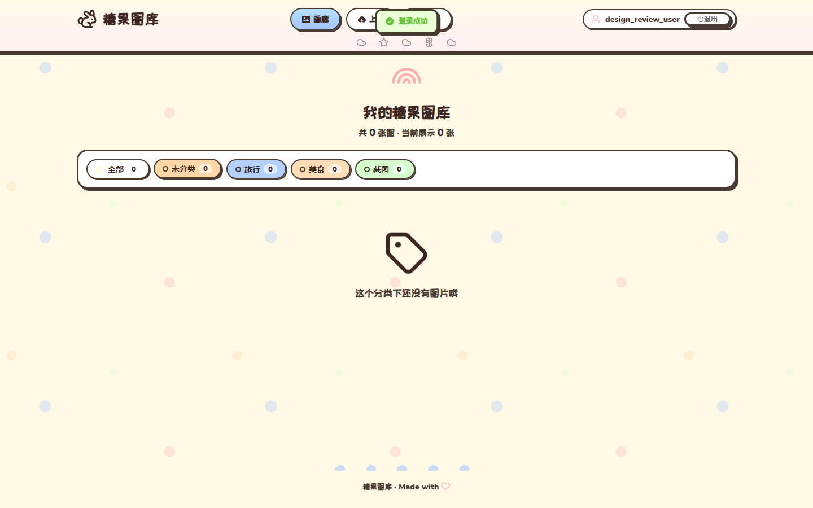 | 选中分类筛选 |
| 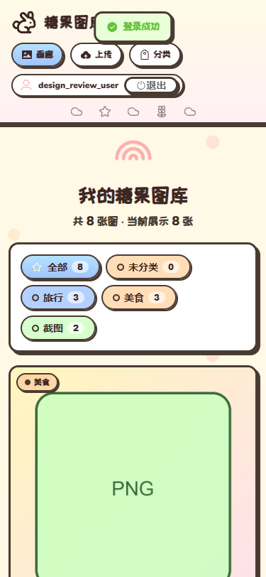 | 移动端单列 |

**优点**：
- 分类筛选条直观，每个分类显示图片数量，激活态加深 + 上浮，反馈清晰。
- 响应式断点合理：1440px 4 列、1024px 3 列、768px 2 列、480px 1 列。
- 图片卡片信息完整：分类标签、下载按钮、媒体角标、元信息。
- 空态文案可爱且有行动指引（「去上传第一张图吧！」）。

**问题与建议**：
- **卡片 hover 依赖鼠标**：下载按钮和「点我看大图」遮罩只在 hover 时显示，移动端用户永远看不到。建议移动端默认显示下载按钮，或长按/点击后显示操作菜单。
- **分类标签文字对比度**：分类颜色由用户选择，若用户选择 `#FDFFB6` 等浅色，深褐文字对比度不足。建议在保存分类时校验颜色对比度，或自动根据背景色切换文字色（深/浅）。
- **「全部」按钮硬编码渐变**：`{ background: 'linear-gradient(180deg, #B5E2FF, #A0C4FF)' }` 没有使用 `--cartoon-blue` token。
- **页面标题数量显示**：`store.images.length` 和 `store.filteredImages.length` 很清晰，但标题区与筛选条间距略大，移动端可以进一步压缩。

### 4.3 图片卡片（ImageCard）

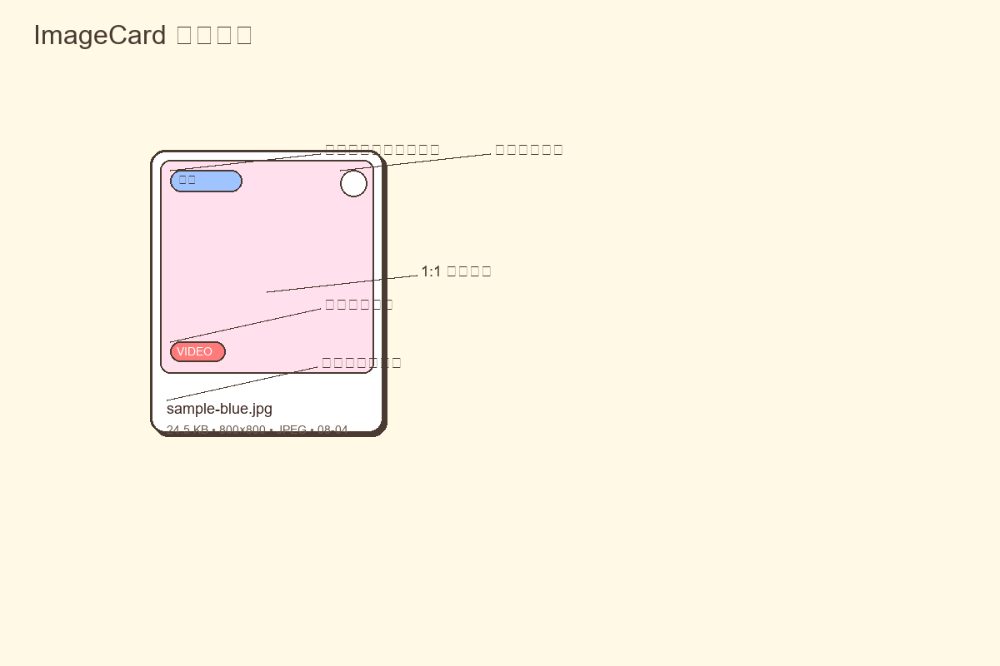

**优点**：
- 1:1 缩略图保证网格整齐，`object-fit: cover` 避免变形。
- 媒体角标区分 VIDEO / GIF / WEBP，颜色与动画各有不同，信息层级好。
- hover 时图片微缩放 + 卡片上浮旋转 + 下载按钮滑入，三层动效叠加但不过分。
- 懒加载 `loading="lazy"` 已开启。

**问题与建议**：
- **下载按钮仅在 hover 显示**：移动端不可见，且可访问性差（键盘无法聚焦一个初始 `opacity: 0` 的元素，虽然实际可以 tab 到，但用户不知道）。
- **分类标签没有关闭/移除入口**：卡片 hover 时只有下载，没有「删除」或「编辑分类」。对于私人图库，快捷操作可以提升效率。
- **视频缩略图**：当前优先使用 `thumbnailUrl`，否则回退到 `<video>`。若视频较大，首帧加载会拖慢网格。建议后端统一生成缩略图（项目已用 ffmpeg 抽帧，但前端仍需要正确 URL）。

### 4.4 预览弹窗

| 截图 | 说明 |
|------|------|
| 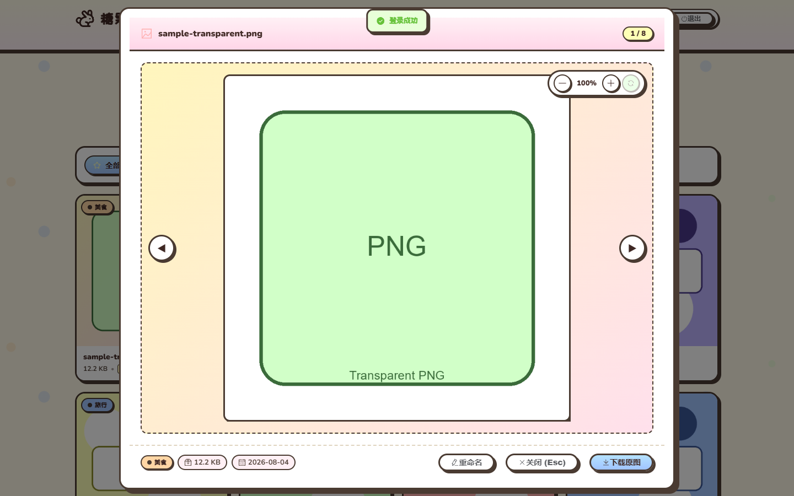 | 桌面端预览 |
| 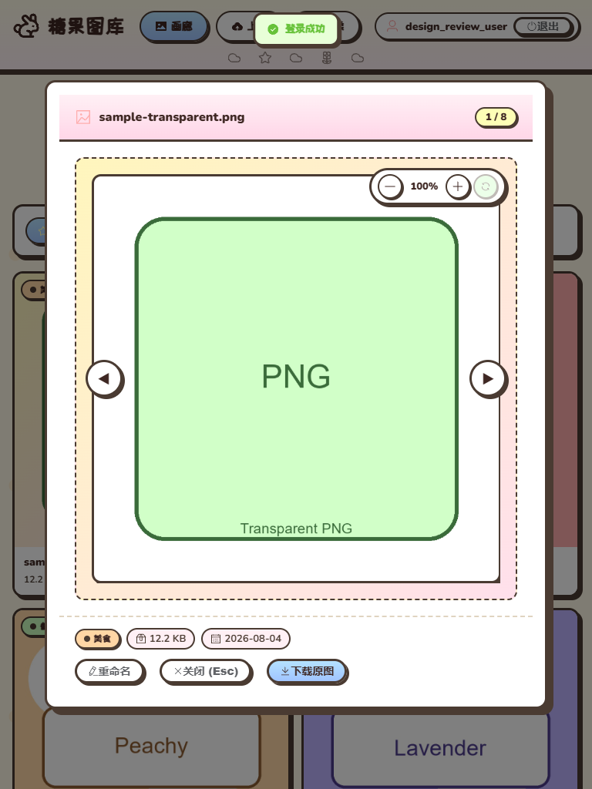 | 平板端预览 |
| 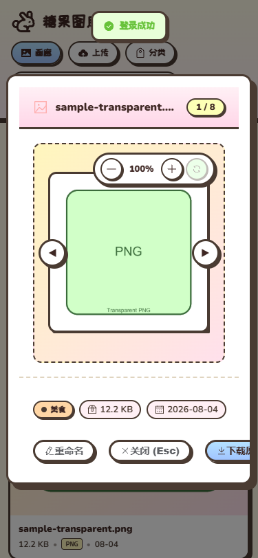 | 手机端预览 |

**优点**：
- 功能非常完整：缩放 0.5x–5x、滚轮以鼠标为锚点缩放、双击 1x↔2x、拖动平移、键盘 ←→ 切换、Esc 关闭、+/- 缩放、0 重置。
- 底部元信息 + 重命名 + 下载按钮布局清晰。
- 视频直接 autoplay 播放，体验自然。

**问题与建议**：
- **关闭按钮缺失**：`show-close="false"` 且 `close-on-press-escape="false"`，用户只能点底部「关闭 (Esc)」或键盘 Esc。对于鼠标用户，缺少右上角 × 不够直觉。
- **焦点管理**：打开弹窗后焦点没有 trap 在弹窗内，Tab 会跑到背景页面。建议增加 `focus-trap` 或手动管理焦点。
- **移动端缩放**：拖动平移依赖鼠标事件，手机上无法双指缩放/拖动。建议为触摸设备添加 `touchmove` / `gesture` 支持。
- **弹窗宽度硬编码**：`dialogWidth` 根据窗口计算，但大屏上图与边框间留白过大，可以优化。

### 4.5 上传页

| 截图 | 说明 |
|------|------|
| 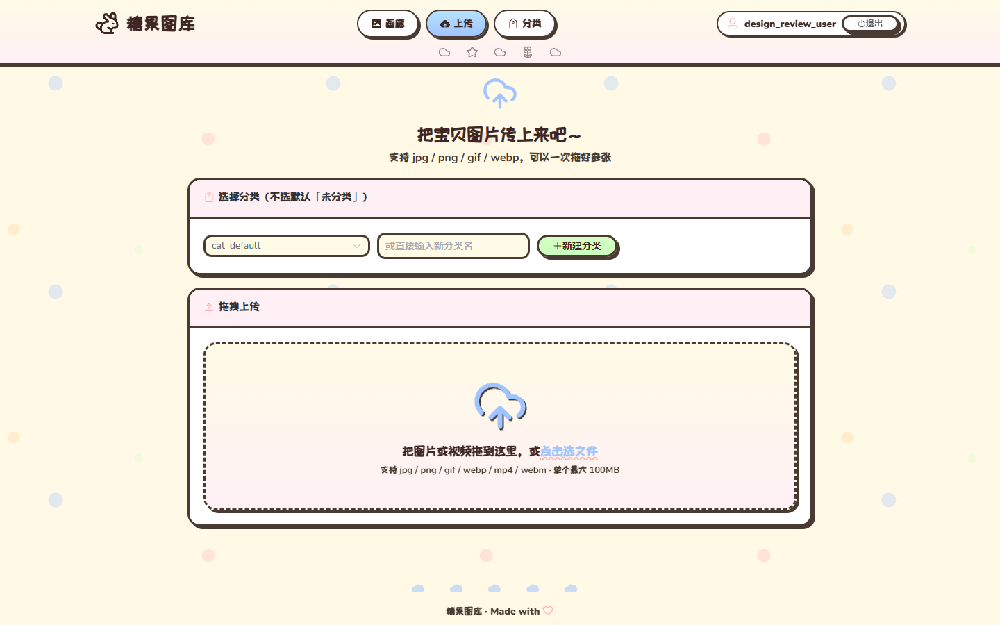 | 桌面端上传区 |
| 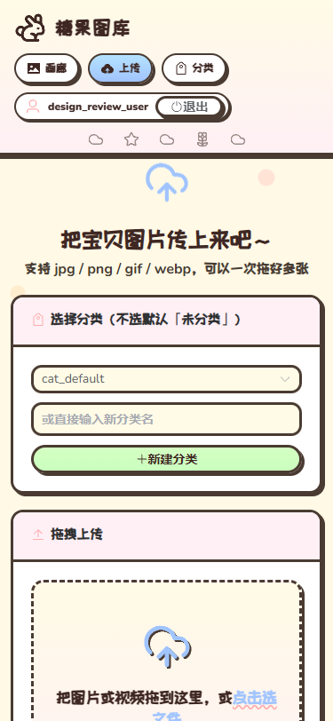 | 移动端上传区 |

**优点**：
- 拖拽区面积大，视觉突出，云朵图标带浮动动画，引导性强。
- 文件列表用 transition-group 实现进入/离开动画。
- 上传进度条采用彩虹渐变，与主题契合。
- 支持选择分类或即时创建新分类，减少页面跳转。

**问题与建议**：
- **拖拽状态反馈**：`el-upload-dragger` 的 hover 样式已覆盖，但没有 drag-over 状态（比如边框变实线、背景变色）。用户拖文件进来时缺乏明确反馈。
- **文件列表操作**：删除按钮在文件上传成功后禁用，但成功文件会自动从列表移除，逻辑一致。不过列表中的缩略图（56×56）对视频来说偏小。
- **移动端分类选择 + 新建输入**：三个控件水平排列，在 375px 下会换行且输入框宽度 100% 有点拥挤。

### 4.6 分类管理页

| 截图 | 说明 |
|------|------|
| 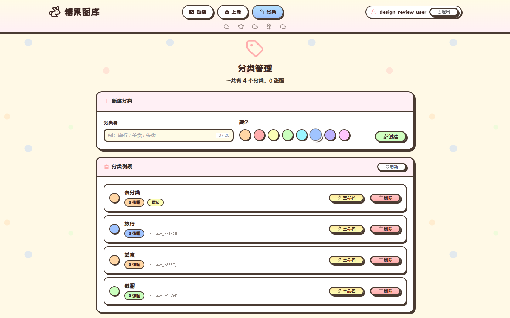 | 桌面端分类列表 |
| 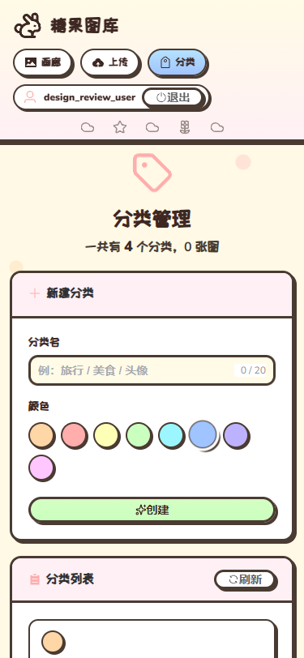 | 移动端分类列表 |

**优点**：
- 新建分类的色板选择直观，圆点带阴影和激活态。
- 编辑模式内联展开，不用跳页。
- 删除前校验关联图片数量，并给出明确提示。
- 默认分类「未分类」不可删除，避免误操作。

**问题与建议**：
- **色板对比度**：8 个预设色中 `#FDFFB6`、`#FFC6FF`、`#FFD6A5` 上写深褐字对比度不足。建议自动计算文字色或限制可选颜色。
- **颜色选择器无标签**：色点是 `button` 但没有 `aria-label`，屏幕阅读器用户不知道当前选的是哪个颜色。
- **分类行在移动端**：名字、数量、操作按钮垂直堆叠，但编辑模式下的颜色选择器会换行，建议移动端编辑时改为下拉或简化。

---

## 5. 跨维度发现

### 5.1 一致性

**好的方面**：
- 所有页面共享 `.page-title` 模式：大图标 + h2 + 副标题，图标都有 `float` 动画。
- 所有卡片内容区都用 `el-card` + `.card-title-icon`。
- 按钮、标签、输入框的圆角/边框/阴影风格统一。

**待改进**：
- **硬编码值较多**：例如 `background: #fff`、`border: 3px solid var(--cartoon-brown)` 在多个组件中重复；`#A0C4FF` 等色值在视图中直接写死。
- **间距不统一**：页面标题下边距有的是 `18px`，有的是 `20px`；卡片间距有的是 `18px`，有的是 `22px`。
- **术语不一致**：
  - Logo/品牌：「糖果图库」
  - 导航：「画廊」
  - 标题：「我的糖果图库」
  - 上传页：「把宝贝图片传上来吧」
  - 空态：「图图们」
  - 建议统一人称和词汇，或至少明确哪些是品牌名、哪些是页面名。

### 5.2 可访问性（Accessibility）

**严重缺失**：
- 无 `prefers-reduced-motion` 媒体查询，所有动画（float、pulse、spin-bounce、shine、hover 动效）对前庭障碍用户不友好。
- 焦点指示器被自定义 box-shadow 覆盖，键盘导航难以看清当前焦点。
- 自定义按钮/色点缺少 `aria-label` 或 `aria-pressed`。
- 图片 `alt` 使用 `originalName`，基本可用，但预览弹窗中视频没有文字替代。
- 弹窗无焦点 trap。
- 登录/注册切换链接不是真正的可聚焦元素。

**建议**：
- 在 `cartoon.css` 中加入：
  ```css
  @media (prefers-reduced-motion: reduce) {
    *, *::before, *::after {
      animation-duration: 0.01ms !important;
      animation-iteration-count: 1 !important;
      transition-duration: 0.01ms !important;
    }
  }
  ```
- 为所有交互元素提供可见焦点环（outline 或高对比 shadow）。
- 为颜色选择器加 `aria-label="选择分类颜色"`。
- 弹窗加 `role="dialog"`、`aria-modal="true"`、焦点 trap。

### 5.3 动画与动效

**优点**：
- 动画种类丰富但不过度：float（3s）、pulse（1.4s）、shine（2.4s）、hover（0.15–0.3s）。
- 页面切换淡入淡出（0.25s）自然。
- 上传列表进入/离开动画增加愉悦感。

**问题**：
- `.loading-emoji` 使用 `spin-bounce` 同时旋转+缩放，对敏感用户可能不适。
- 所有 hover 效果在触摸屏上无法触发，造成桌面/移动体验割裂。

### 5.4 响应式

- 断点覆盖主流设备，网格折叠合理。
- 但在 768px 以下，顶部导航栏的 `flex-wrap` 会让用户区换行，与装饰条之间的空间变窄。
- 预览弹窗在移动端宽度接近全屏，但缩放/拖动操作没有触摸适配。

### 5.5 图标系统

| 用途 | 当前方案 | 评价 |
|------|---------|------|
| 功能图标 | `@element-plus/icons-vue` | 一致、已安装、零依赖 |
| 情绪/装饰 | `@iconify/vue` (Lucide) | 偏冷淡，与卡通主题略有温差 |
| 吉祥物 | `lucide:rabbit` | 简笔兔子，撑不起「吉祥物」角色 |

**建议**：
- 功能图标继续使用 Element Plus。
- 情绪图标可考虑 Phosphor Duotone（更柔和、有填充）或 Solar Bold Duotone（更糖果色），这与 `icon-compare.html` 的结论一致。
- 兔子 Logo 建议：保留 emoji 🐰、使用 OpenMoji 统一渲染、或定制手绘 SVG。定制 SVG 最能契合描边+硬阴影主题。

---

## 6. 优先级建议

### 🔴 高优先级

1. **增加 `prefers-reduced-motion` 支持**
   - 文件：`client/src/styles/cartoon.css`
   - 动作：添加全局 reduced-motion 媒体查询，禁用或简化动画。

2. **修复可访问性焦点与语义**
   - 文件：`client/src/views/LoginView.vue`、`client/src/views/CategoryManage.vue`、`client/src/views/GalleryView.vue`
   - 动作：为自定义交互元素加 `aria-label`、将登录切换链接改为 button、为弹窗加焦点 trap。

3. **分类颜色对比度校验**
   - 文件：`client/src/views/CategoryManage.vue`、`client/src/components/ImageCard.vue`
   - 动作：保存分类时计算背景色与深褐字的对比度，低于 4.5:1 时自动切换文字为白色或提示用户换色。

4. **移动端卡片操作可见**
   - 文件：`client/src/components/ImageCard.vue`
   - 动作：在触控设备上默认显示下载按钮，或增加点击后的操作菜单。

### 🟡 中优先级

5. **统一设计 token，减少硬编码**
   - 文件：所有 `.vue` 文件
   - 动作：将常用颜色/间距提取到 `cartoon.css` 的 `:root` 变量中。

6. **优化图标系统**
   - 文件：`client/src/components/AppHeader.vue`、`client/src/views/*.vue`
   - 动作：情绪图标换 Phosphor Duotone；Logo 使用 🐰 emoji 或定制 SVG。

7. **预览弹窗增加关闭按钮与触摸缩放**
   - 文件：`client/src/views/GalleryView.vue`
   - 动作：恢复右上角关闭按钮、添加 touch 事件支持。

8. **拖拽上传状态反馈**
   - 文件：`client/src/styles/cartoon.css`
   - 动作：为 `.el-upload-dragger` 增加 drag-over 样式。

### 🟢 低优先级

9. **统一术语与人称**
   - 文件：所有视图
   - 动作：确定品牌名、页面名、提示文案的用词规范。

10. **加载状态骨架屏**
    - 文件：`client/src/views/GalleryView.vue`
    - 动作：当前只有 spinner，可增加占位卡片骨架屏减少布局跳动。

11. **视频缩略图优化**
    - 文件：`client/src/components/ImageCard.vue`
    - 动作：确保后端生成的首帧缩略图 `thumbnailUrl` 优先返回。

---

## 7. 附录

### 7.1 截图清单

| 截图 | 文件 |
|------|------|
| 登录页-空-桌面 | `screenshots/login-empty-desktop.png` |
| 登录页-已填-桌面 | `screenshots/login-filled-desktop.png` |
| 画廊页-桌面 | `screenshots/gallery-populated-desktop.png` |
| 画廊页-筛选-桌面 | `screenshots/gallery-filtered-desktop.png` |
| 上传页-桌面 | `screenshots/upload-empty-desktop.png` |
| 分类页-桌面 | `screenshots/categories-list-desktop.png` |
| 预览弹窗-桌面 | `screenshots/preview-modal-desktop.png` |
| 各页面平板/移动端 | 同名 `-tablet` / `-mobile` 文件 |

### 7.2 关键文件路径

| 文件 | 说明 |
|------|------|
| `client/src/styles/cartoon.css` | 设计 token + Element Plus 覆盖 |
| `client/src/components/AppHeader.vue` | 顶部导航 |
| `client/src/components/ImageCard.vue` | 图片卡片 |
| `client/src/views/LoginView.vue` | 登录/注册 |
| `client/src/views/GalleryView.vue` | 画廊 + 预览弹窗 |
| `client/src/views/UploadView.vue` | 上传 |
| `client/src/views/CategoryManage.vue` | 分类管理 |
| `icon-compare.html` | 图标库对比设计稿 |

### 7.3 UX 流程图

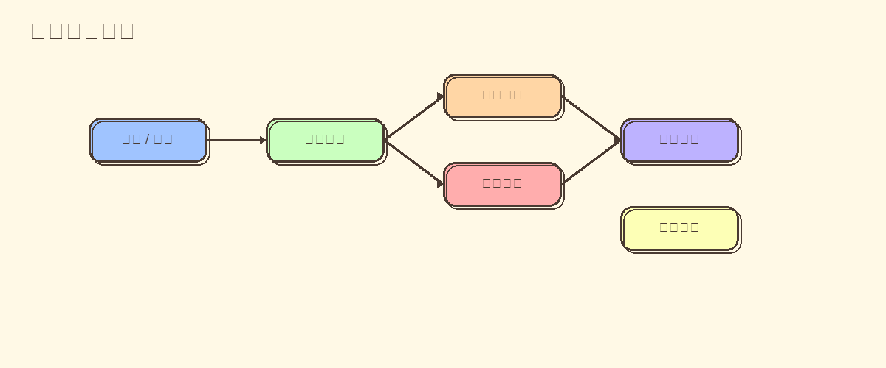

---

*报告由 Mochi 🍡 生成*
